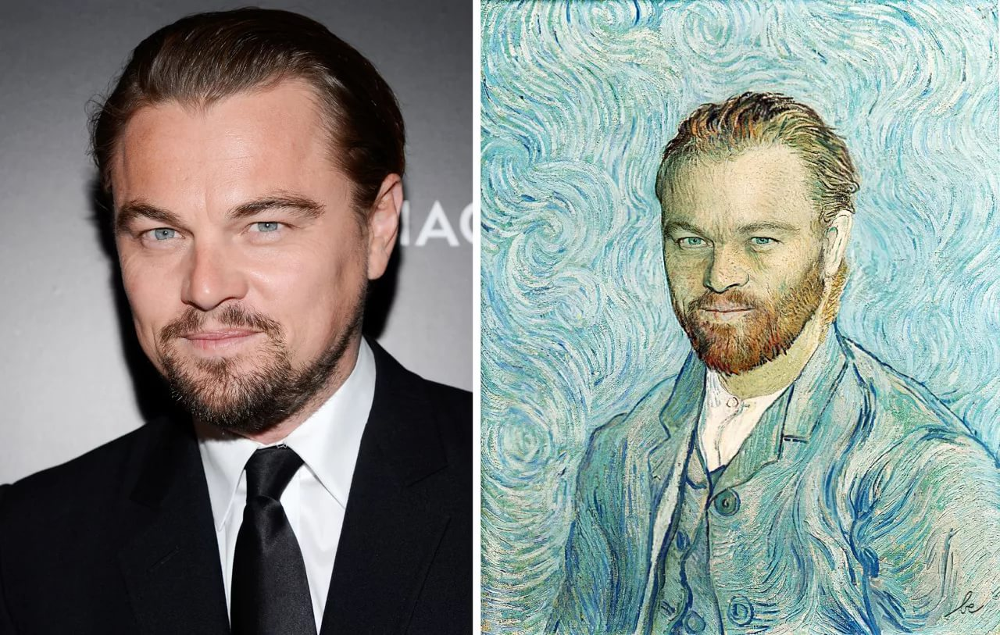

# Нейронная передача стиля





Алгоритм нейронного переноса стиля, преобразует полученное на вход изображение в соответствии с выбранным стилем. Алгоритм использует два изображения:

  - Изображение контента (Content Image), в котором нас интересует содержание. Обычно оно является фотографией.
  - Изображение стиля (Style Image), в котором нас интересует художественный стиль (цветовое наполнение, текстуры и т.д.). Обычно изображением стиля являются картины известных художников.


Затем алгоритм изменяет входные данные так, чтобы они соответствовали содержанию изображения контента и художественному стилю изображения стиля.


# Реализация нейронной передачи стиля с Qt

  Приложение написано на языке программирования **python** с использованием фреймворка **qt**. Пользователь без труда может выбрать изображение-стиль и изображение-контент в формате ***'jpg'*** и через несколько секунд получить сгенерированное изображение, которое загрузится автоматически в папку **'stored'** и отобразит пользователю.
  В приложении большое количество подсказок и всплывающих окон.
  Общий алгоритм преобразования состоит в следующем:
  - открыть главное окно и нажать на кнопку загрузки изображений
  - загрузить изображения
  - обучить нейронную сеть нажатием на соответствующую кнопку слева внизу
  - получить результаты


Также в приложении есть возможность работы с базой данных, который разработан согласно принципам построения реляционных БД и их *нормализации*. Пользователь имеет возможность скачивать из БД примеры стилей и сгенерированных изображений, метаданные изображений в формате **csv**, также добавлять новые записи.
В папке проекта есть несколько каталогов:

| Каталог | Предназначение |
| ------ | ------ |
| database | для хранения базы данных |
| download | для загрузки примеров из базы данных|
| res | для хранения ресурсов проекта |
| saved | для хранения результатов |
| src | исходный код приложения, разбитый на несколько модулей|


# Предупреждения и ссылки на источники
> Информация по работе с генеративным
> нейронным обучением
> заимствована с официального
> сайта библиотеки глубокого
> обучения [**tensorflow**](https://www.tensorflow.org/tutorials/generative/style_transfer).
> Так как веса предварительно обученной
> нейронной сети загружаются из Сети,
> **убедитесь,** ****что у Вас есть выход в Интернет!****
> Также модель загружается в виде сжатого архива
> и кэшируется на диске, поэтому в случае проблем
> необходимо почистить кэш  ```sh/tmp/tfhub_modules```,
> либо установить переменную среды ```shTFHUB_CACHE_DIR```


### Установка и запуск

Для запуска приложения с исползованием интерпретатора python рекомендуется использовать использовать python3.8.
Предварительно необходимо установить все внешние библиотеки.

```sh
$ pip install -r requirements.txt
```


